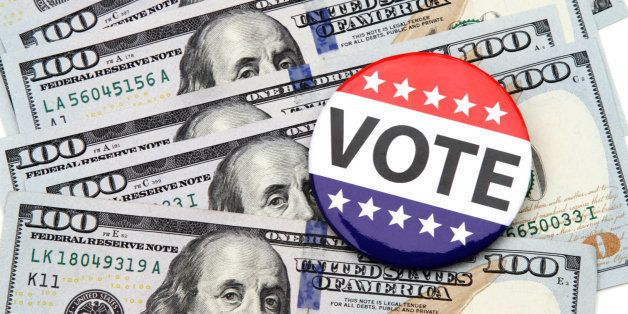

```{r, warning=FALSE, message=FALSE,echo=FALSE}
knitr::opts_chunk$set(echo = TRUE)
```

```{r, message=FALSE, warning=FALSE,echo=FALSE}
packages.used=c("tm", "tidytext","tidyverse","DT","wordcloud","scales","gridExtra","ngram","igraph","ggraph","rsconnect")
# check packages that need to be installed.
packages.needed=setdiff(packages.used, 
                        intersect(installed.packages()[,1], 
                                  packages.used))
# install additional packages
if(length(packages.needed)>0){
  install.packages(packages.needed, dependencies = TRUE)
}
# load packages
library(tm)
library(tidytext)
library(tidyverse)
library(DT)
library(wordcloud)
library(scales)
library(gridExtra)
library(ngram)
library(igraph)
library(ggraph)
library(rsconnect)
```


# 1. Introduction
### Proposal
Money occupies a significant part of people's lives, and it is also closely related to national policies. If you can make more money for the people, you have a better chance of earning everyone's votes. Therefore, we will use the ANES dataset to delve into this topic by solving the following three questions: Are people care about their money and national economics? How people's financial condition affect their vote? What economic policy should the candidate use to influence the election?

### Dataset
[American National Election Studies (ANES) - 2020 Exploratory Testing Survey](https://electionstudies.org/data-center/2020-exploratory-testing-survey/)

### Enviroment
This report is prepared with the following environmental settings.


```{r}
print(R.version)
```

```{r read data, warning=FALSE, message=FALSE,echo=FALSE}
urlfile<-'../data/anes_pilot_2020ets_csv.csv'
use_data <- read_csv(urlfile)
```

# 2. Questions

#### We will use three questions step by step to bring out our story -- the relation between money and election.

---

## Question1: The annual income distribution of the American family? 

First, we investigate people's views on the current economic environment. How do they feel? And what is their financial situation?


```{r,echo=FALSE}
all_people_anes <- filter(use_data, use_data$inc_anes<66)
all_people_cps <- filter(use_data, use_data$inc_cps<66)
all_people_cpsmod <- filter(use_data, use_data$inc_cpsmod<66)
all_people_anes %>% mutate(income=as_factor(all_people_anes$inc_anes))
all_people_cps %>% mutate(income=as_factor(all_people_cps$inc_cps))
all_people_cpsmod %>% mutate(income=as_factor(all_people_cpsmod$inc_cpsmod))
all_income <- rbind(all_people_anes, all_people_cps, all_people_cpsmod)
```

### People are very anxious about the current economic environment
The bar graph below shows that many people are extremely worried about the economic environment, and their emotions are in a very extreme state.

```{r worry, echo=FALSE}
data_worry <- filter(all_income, all_income$econnow<6)
p <- ggplot(data = data_worry, aes(x = econnow)) + geom_bar(colour = 1, 
    width = 0.3, fill = "#CD0000") + labs(x = "Not at all worried <-------------------------------------> Extremely worried", title = "The degree of people's concern about the economy")
p + theme(plot.title = element_text(colour = "black", face = "bold", size = 13, hjust = 0.5), axis.text.x = element_text(angle = 0, vjust = 0.5))
```

Therefore, the candidate who can **propose a reasonable policy, and somehow fix the economic environment**, the candidate will earn people's attention and win the election!

---

### The financial situation of the people in the survey
To see a particular political standpoint and how the economic policies affect people's voting, we first take an in-depth look into people's annual income.


```{r year barplot,echo=FALSE}
barplot(table(all_income$income),
        las=2,
        ylim=c(0,250),
        main="number of income / year",
        names.arg=c("Under $5,000","5,000-9,999", "10,000-14,999", "15,000-19,999", "20,000-24,999", "25,000-29,999","30,000-34,999",  "35,000-39,999", "40,000-44,999", "45,000-49,999","50,000-54,999", "55,000-59,999", "60,000-64,999", "65,000-69,999","70,000-74,999", "75,000-79,999", "80,000-84,999", "85,000-89,999","90,000-94,999", "95,000-99,999", "100,000-124,999", "125,000-149,999","150,000-174,999", "175,000-199,999", "200,000-249,999", "250,000 or more"), cex.names=0.66)
```
As we seen above, we can find that the median of the annual income is:
```{r, echo=FALSE}
median(c(all_people_cps$inc_cps, all_people_anes$inc_anes, all_people_cpsmod$inc_cpsmod))
```


Which is range between $50,000 - $54,999. Moreover, we found that the distribution of annual income presented in a **V** shape means most people are either rich or poor. How to make society more balanced is one of the most important issues faced by every presidential candidate.

---

## Question2: According to different financial conditions, which candidate and political party they will vote?

To make the statement more precise, we will use the first question to analyze in the next step. In our second question, we want to see people's voting preference in every economic range. Try to figure out each presidential candidate needs to focus on which group to win the election.

### The ratio of president preference in each economic range

First, we compare voters' voting tendency in each financial section toward president candidates **Donald Trump** and **Joe Biden**.

As shown in the following figure, the red bar represented Donald Trump, the blue bar represented Joe Biden, and the yellow bar and gold bar are someone else and not vote. Moreover, we change the y axis to ratio to clarify the percentage of the voting preference.

We can observe a phenomenon that if the people's annual income is lower than $10,000, they tend to untrust all candidates and try to seek help for others. Therefore, there is an opportunity to both candidates that **they can quickly figure out ways to win votes from those who have no political preferences**.

On the other hand, people who have higher income prefer Donald Trump. This situation may be due to factors related to tax cuts in 2017 (we will figure it out later). But Donald Trump needs to figure out what policies should be proposed to benefit the general public to win more votes. In Joe Biden's viewpoint, he needs to figure out how to make rich people more inclined to support him.


```{r vote analysis, fig.height=4, fig.width=10, echo=FALSE, message=FALSE}
warnings('off')
#anes_vote_fin_ <- all_income%>%group_by(income)%>%count(vote20jb)%>%group_by(income)%>%mutate(prop=n/sum(n))
anes_vote_fin_ <- all_income %>%
  select(income, vote20jb) %>%
  group_by(income, vote20jb) %>%
  summarise(n = n()) %>%
  mutate(Ratio = n / sum(n)) %>%
  ungroup()
#%>%
#  filter(vote == "1. Democrat" | vote == "2. Republican")
p <- ggplot(data = anes_vote_fin_,
  mapping = aes(
    x = income, 
    y = Ratio,
    fill = factor(vote20jb)),  xlab = "income") 
p + geom_col(position= "fill") + labs(title="The Ratio of president preference in each financial condition") + scale_fill_manual(values = c("firebrick2", "dodgerblue3", "gold1", "lightgoldenrod1", "white")) + theme(plot.title = element_text(colour = "black", face = "bold", size = 40, hjust = 0.5), axis.title.x = element_text(size = 30, vjust = 0.5), axis.title.y = element_text(size = 30, vjust = 0.5))


```

---

## The ratio of party preference in each economic range

Second, we compare voters' voting tendency in each financial section toward political parties  **Democrat** and **Republican**.

As shown in the following figure, we can further confirm our idea about the relation between people with different income and their political preference. The red bar represented Republican, the blue bar represented Democrat, and the yellow bar, gold bar, and white bar are others else, not vote, and don't know. 

```{r, fig.height=4, fig.width=10, echo=FALSE, message=FALSE}
anes_party_fin_ <- all_income %>%
  select(income, cvote2020) %>%
  group_by(income, cvote2020) %>%
  summarise(n = n()) %>%
  mutate(Ratio = n / sum(n)) %>%
  ungroup()
p <- ggplot(data = anes_party_fin_,
  mapping = aes(
    x = income, 
    y = Ratio,
    fill = factor(cvote2020)),  xlab = "income") 
p + geom_col(position= "fill") + labs(title="The Ratio of party preference in each financial condition") + scale_fill_manual(values = c("dodgerblue3", "firebrick2", "gold1", "lightgoldenrod1", "white")) + theme(plot.title = element_text(colour = "black", face = "bold", size = 40, hjust = 0.5), axis.title.x = element_text(size = 30, vjust = 0.5), axis.title.y = element_text(size = 30, vjust = 0.5))

```


---

## Question 3: How to use economic policies to change people's preference?
According to the analysis above, we can think about earning people's hearts according to their financial situation and their preference using politics!

### Does 2017 law that reduced federal tax rates for individuals and businesses helped or hurt the nation's economy?

We can see that if the tax rate is lowered, people will be happier. Therefore, if the candidate wants to earn people's votes, he needs to take care of the tax rate policies.


```{r eco, echo=FALSE}
ecno = filter(all_income, all_income$taxecon<8)
p <- ggplot(data = ecno, aes(x = taxecon)) + geom_bar(colour = 1, 
    width = 0.4, fill = "steelblue1") + labs(x = "Helped<-------------------------------------------------------------------------->Hurt", title = "People's opinion about 2017 law")
p + theme(plot.title = element_text(colour = "black", face = "bold", size = 15, hjust = 0.5), axis.text.x = element_text(angle = 0, vjust = 0.5))
```


Next, we delve into the preference for the tax rate in people with different income range. We can find that wealthier people intend to favour the policy about reducing the tax rate. Combining with the Q2, we can see that lowering the taxing rate will make rich people prefer to vote, and that is why Donald Trump has a higher voting rate in the high-income range.

On the other hand, people who have lower annual income tend to oppose this policy. Therefore, if the candidate wants to earn the vote from these people, lowering the tax rate might not be the right choice. 

```{r, fig.height=4, fig.width=10, echo=FALSE, message=FALSE}
data_eco <- all_income %>%
  filter(all_income$econpres7<8) %>%
  group_by(income, econpres7) %>%
  summarise(n = n())
p <- ggplot(data = data_eco, 
            mapping = aes(income, econpres7))
p + geom_tile(aes(fill = n), colour = "white") + scale_fill_gradient2(low = "white", high = "steelblue") + theme(plot.title = element_text(colour = "black", face = "bold", size = 40, hjust = 0.5), axis.text = element_text(size = 20,angle = 0, vjust = 0.5), axis.title = element_text(size=30,face="bold")) + labs(x = "Poor people <----------------------------------------------------------------------------------------> Rich people", y = "Favor <----------------------> Oppose", title = "Favor about Trump") 
```

---

### Rich people need to pay more tax?

Because people with lower incomes don’t like the policy about lowering the tax rate, we need to figure out another way to earn their votes!

Therefore, according to the figure below, we find that people favour taxing the rich people who make $10 million a year or make money more than at a 70% rate people.

```{r,echo=FALSE}
form1tax <- filter(use_data, use_data$billtax1<8)
form2tax <- filter(use_data, use_data$billtax2<8)
tax_total = rbind(mutate(form1tax, tax = billtax1), mutate(form2tax, tax = billtax2))

```

```{r tax, echo=FALSE}
p <- ggplot(data = tax_total, aes(x = tax)) + geom_bar(colour = 1, 
    width = 0.4, fill = "#54FF9F") + labs(x = "Favor<----------------------------------------------------------------------->Oppose", title = "The number of support the Rich People Tax")
p + theme(plot.title = element_text(colour = "black", face = "bold", size = 10, hjust = 0.5), axis.text.x = element_text(angle = 0, vjust = 0.5))
```

Next, we also delve into the policy's preference related to tax more on rich people in different income ranges. Finally, we found that the people in almost all income range tend to support this policy. We can see that although some people who favour this policy are in the higher income range, the field are between $9,5000 - $125,000, lower than the target of the policy who need to have the annual income higher than **$10,000,000$**.


```{r, fig.height=4, fig.width=10, echo=FALSE, message=FALSE}
form1tax_in <- filter(all_income, all_income$billtax1<8)
form2tax_in <- filter(all_income, all_income$billtax2<8)
tax_total_in = rbind(mutate(form1tax_in, tax = billtax1), mutate(form2tax_in, tax = billtax2))
data_eco_tax <- tax_total_in %>%
  group_by(income, tax) %>%
  summarise(n = n())
p <- ggplot(data = data_eco_tax, 
            mapping = aes(income, tax))
p + geom_tile(aes(fill = n), colour = "white") + scale_fill_gradient2(low = "white", high = "#008B45")  + theme(plot.title = element_text(colour = "black", face = "bold", size = 40, hjust = 0.5), axis.text = element_text(size = 20,angle = 0, vjust = 0.5), axis.title = element_text(size=30,face="bold")) + labs(x = "Poor people <----------------------------------------------------------------------------------------> Rich people", y = "Favor <----------------------> Oppose", title = "Taxing people making $10 million a year or more than at a 70% rate") 
```

#### Finally, we can announce that the candidate who want to earn more votes, taxing more on the people who make $10 million a year!

